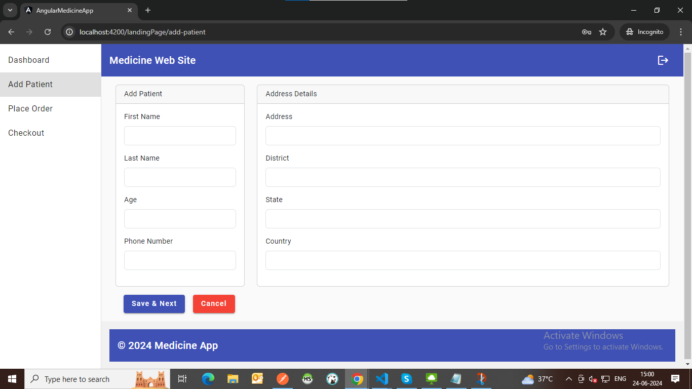

<!-- Installation instructions -->

1: npm install command

2: Instructions on how to run the application (ng serve, etc.)

 3: Navigate to http://localhost:4200/ in your web browser.

 ## Login Credentials
 To access the admin dashboard, use the following credentials:

Mobile Number: 7777777777
Password: test@api

 ## Admin Dashboard

 
Once logged in, the admin will navigate to the landing page with a sidebar, header, and footer, along with the dashboard.

## Dashboard

On the dashboard, use the search functionality to find medicines by their name. Clicking on search will display related medicine details in cards.

## Adding Patient for Order Placement

Admin can add patients with all necessary details. Patient details are saved in localStorage for future reference.

## Placing an Order

Select a patient from the list.
Choose medicine details, quantity, and rate.
Add items to the cart.

   
## Checkout Order Summary

In the checkout order summary, view and manage product details. Items can be added or removed, and changes are reflected in local storage.

## Order Successfully Placed

After successfully placing an order, view the order details including address and delivery date.
   

